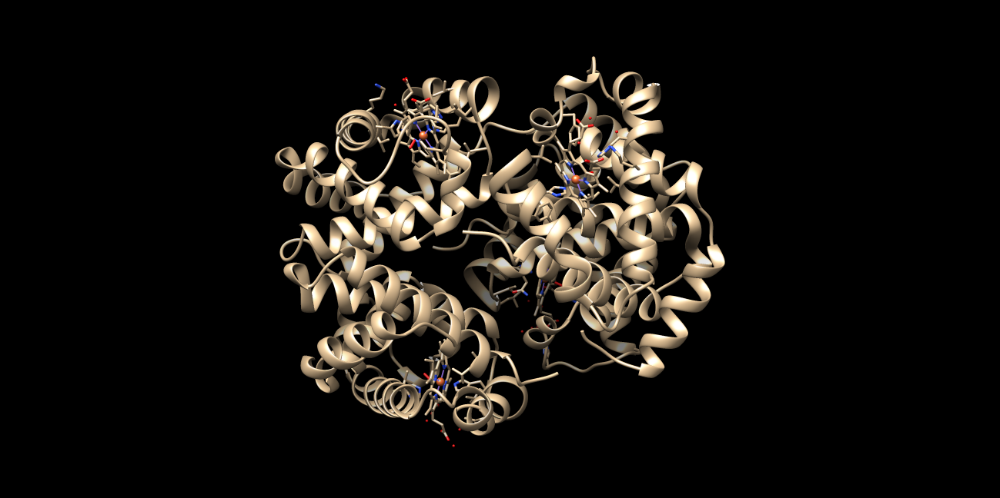
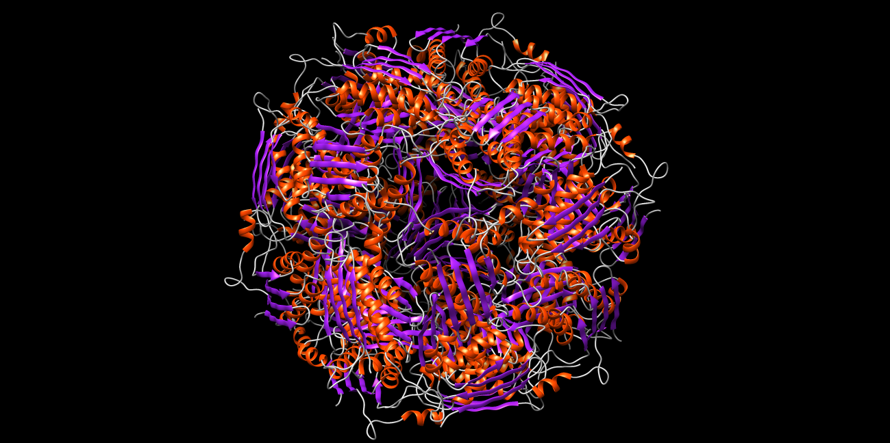
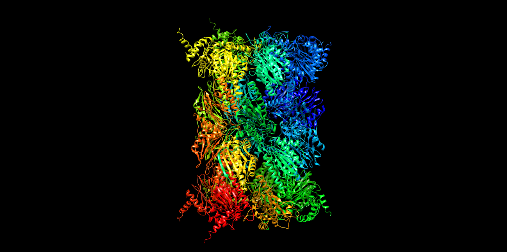
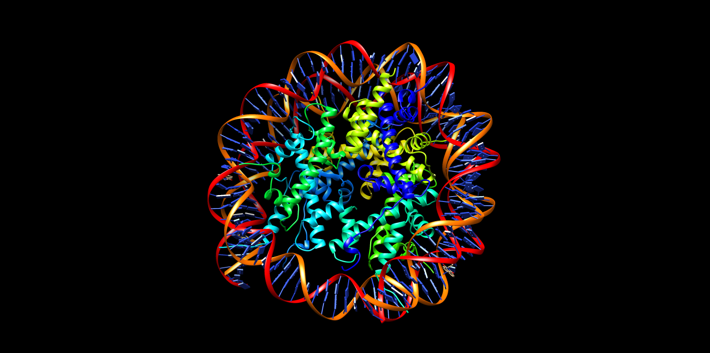
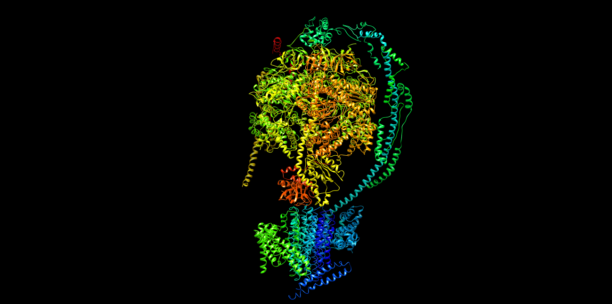
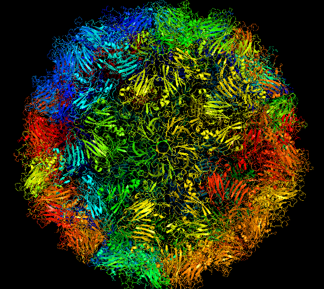
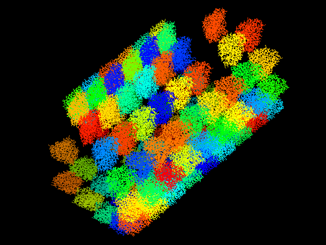

# SBI-project

A python package for macrocomplex modeling from protein interaction pairs.

## Introduction

This is a usage tutorial of the Complexbuilder command-line application.

The objective of this project is to reconstruct a complete macrocomplex from a given set of interacting pairs of proteins. The package returns a PDB of CIF file with the possible models that were built.

Developers: Núria Olvera Ocaña and Helena Catena Sánchez, from the UPF MSc of Bioinformatics for Health Sciences.

## Installation

To install this package you must clone the it from GitHub:

    git clone https://github.com/helendragon/SBI_Project.git

    cd complexbuilder

And run the next command:

    sudo python3 setup.py install

Now the package can be ran from any part of your system, you don’t have to be in the complexbuilder folder to use it.

## How does it work?

### Input and Output Files

The input is a set of __PDB files__ holding pairs of proteins interacting. These inputs can be either redundant (all the possible interactions of the macrocomplex) or unique interactions (only those necessary to build the complex).  
This program __does not__ accept compressed files.

It is important to consider that the output files will depend on the command-line options and arguments the user determines while performing the analysis.
The output will be saved in the directory defined by the user or in the current directory.  
Depending on the size of the macrocomplex, it will be saved in .pdb or .cif format.  
It's __very important__ that the user checks each of the models that are crated, since they can vary between them.

### Python Modules

* __complexbuilder:__ This is the _main_ module or program created to reconstruct a macrocomplex given interaction pairs of protein-protein or protein - RNA.
In addition, this module has the Argument Parser object, from the argparse module from python. This module it's used to give to the program command-line options and arguments.

* __functions.py:__ This module is formed by the different __functions__ used to go from the set of pairs of interactions to the final macrocomplex. This module is imported to the _main_ module so that the functions can be used.

* __classes.py:__ This module is composed by the different __class__ errors that can be raised during the execution of this package.

* __utilities.py:__ This module is composed by different variables needed for the functions and __main__ module during the analysis.

### Command-line Arguments

* __-i --input__: Input a directory containing the pdb files with the interactions pairs that the user wants to process. If no input is given, the package will try to look for the files in the current directory.

* __-o --output__: Output directory where the macrocomplexes will be saved as PDB files or CIF files. This can also be the name that the user wants the complexes to have. If no output is defined, it will be saved by the default name in the current directory.

* __-c --clashes__: Minimum clash distance between 2 atoms. The default minimum is 1.5 A.

* __-n --number__: Maximum number of clahses permitted between 2 structures. The default maximum is 5.

* __-C --chains__: Maximum number of chains (iterations) the user wants to add to the complex. This is useful when only one interaction pair is given and it could be added infinite times. The default value is 100.

* __-m --models__: Maximum number of files (complexes) the user wants to obtain. If this is not specified, the maximum number of complexed will be 5.

* __-u --unique__: Gives the user the option to tell the program that the interactions that are given are not redundant. By default this is set to false.

* __-v --verbose__: indicates if the progression log has to be printed. By default this is set to false.

### Algorithm of the Package

The problem that is presented to us is to reconstruct a macrocomplex using the interaction pairs given by the user.    
The way that we have approached this issue is by first of all identifying those sequences that are the same (that have a pairwise sequence identity of > 98%). We assumed that, if they have a very similar sequence, there are a lot of chances that they have the same structure, therefore they can be superimposed.   
Next, in order to start building the complex, we thought that is was important that the first structure to be added in the complex was one that had the maximum number of interactions. By doing this we would avoid starting with structures that would have very limited interactions and  the program could not create the whole complex from them. Since it is possible that a many structures have the maximum number of interactions, all of them are used as the first structure (seed structure) to be added to the complex. By doing this many models can be formed, however by default the maximum models is 5.   
The next step is the construction of the macrocomplex.
We do it by iterating through each chain of the macrocomplex. First we look for all the interactions that a given macrocomplex chain has, and we try to superimpose the structures that interact with it. Once we superimpose, we apply the rotation matrix to the chain that has to be added and the clashes between the atoms are checked. If clashes are found, the chain is not added and the program passes to the next interaction. If no clashes are found the structure is added to the complex and the program passes to the next interaction, and so on.  
The program will continue to check if chains can be added until there are no more chains to look for in the complex. In other words, at the end, all the chains in the complex have been checked and no more structures can be added because there are clahses between the structure to be added and the complex.    
This process is repeated for all the seed structures.   
Finally, the models are saved into PDB or CIF format, depending on how many chains the final complex has.

### System Requirements

In order to run this package with all its functionalities the user must have several programs:
* Python 3
* Chimera or Pymol
* Python modules:
    * biopython
    * copy
    * argparse
    * re
    * sys
    * os

## Tutorial and Analysis

The following section explains the user how to use our application to make the most out of it.

### Example 1 - Hemoglobin (1gzx)

This example corresponds to the hemoglobin (PDB: 1gzx). The input file provided does have the redundant interactions of the protein. To obtain a complex we would do:

    complexbuilder -i /inputs/hemoglobin/ -o /outputs/ -m 1

Where _-i /input/hemoglobin/_ is the directory where the PDB files with the interaction pairs are found. The _-o /outputdir/_ is the output directory where the complexed will be saved. Since no name for the complex is provided, it will be saved by the default name. The _-m 1_ means that only 1 model will be made. We decide to do this because the complex to be formed is very simple. The rest of the option are left as default (clash distance: 1.5 A and minimum of clashes: 5). 

The complex that is obtained is the following: 

     

This program is able to properly fully reconstruct this complex with the interactions given as we can see in the image above. It has no problem dealing with this type of interactions.  
Once we superpose the complex with the original structure, it can be seen that there nearly no differences between the 2 structures. If we run the MatchMaker tool from chimera we can see that is returns an RMSD of 0.00 A, indicanting that they are indentical.

### Example 2 - Phosphate dehydratase (6ezm)

This example corresponds to the phosphatase dehydratase (PDB: 6ezm), the example provided to us by our professors.
To obtain the complex we would do:

    complexbuilder -i /intputs/example -o /outputs/example.pdb -m 1 -v

This example is very similar to the last one. The input directory is defined and the output as well. However this time we are specifying the name of the output complex (in case that the complex formed cannot be saved in PDB formed, an error will be raised). Here we will also only generate 1 model and will activate the verbose argument. The rest of the arguments are left as default.

The complex that is obtained is the following:

     

This program is able to properly fully reconstruct this complex with the interactions given as we can see in the image above.  
Once we superpose the complex with the original structure, it can be seen that there nearly no differences between the 2 structures. If we run the MatchMaker tool from chimera we can see that is returns an RMSD of 0.64 A, indicanting that they are very similar.

### Example 3 - Proteosome (3kuy)

This example corresponds to the proteosome (PDB: 4r3o). The input provided has all the interactions of the proteins.   
To obtain the complex we would do:

    complexbuilder -i /intputs/proteosome

Here we are specifying the input but not the output. Therefore the models will be saved in the current working directory by the default name. In this case we are generating the default 5 models, therefore we will have to manually check them and evaluate which one is the best one.

The best complex that is obtained is the following:

     

This program is able to properly fully reconstruct this complex with the interactions given as we can see in the image above.  
Once we superpose the complex with the original structure, it can be seen that there nearly no differences between the 2 structures. If we run the MatchMaker tool from chimera we can see that is returns an RMSD of 0.00 A, indicanting that they are indentical.

### Example 4 - Nucleosome (3kuy)

This example corresponds to the nucleosome (PDB: 3kuy). The input provided has all the interactions of the proteins with the DNA.   
To obtain the complex we would do:

    cmplexbuilder 

Here we are not giving any input or output to the program. So it will look for the files in the current directory and will give the outpur as default name in the current directory. It will also make 5 complexes.

The best complex that is obtained is the following:

     

This program is able to properly fully reconstruct this complex with the interactions given as we can see in the image above. It has no problem dealing with this type of interactions (Protein and DNA). 
Once we superpose the complex with the original structure, it can be seen that there nearly no differences between the 2 structures. If we run the MatchMaker tool from chimera we can see that is returns an RMSD of 0.00 A, indicanting that they are indentical.

### Example 5 - ATP Synthase (5ara)

This example corresponds to the ATP Synthase (PDB: 5ara). It corresponds to a very complex protein, whith a lot of chains and interactions. Modeling it has been very challenging. Here we are doing it with all the interactions.  
To obtain the complex we would do:

    complexbuilder -i /5ara_all -o /results -c 2.5 

Here we are giving the input directory and the output directory as well. In this example we are modifying the minimum clash distance, since we have seen that the program makes this protein better when the minimum clash distance is increased (maybedue to the fact the protein is very complex).

The best complex that is obtained is the following:

     

We can see that the program is not able to perfectly reconstruct the 5ara protein. We see that there are more chains that there should be, due to the high complexity of the protein. However, the overall structure is very well obtained and resembles a lot the real protein. 
Once we superpose the complex with the original structure, we see that it has a RMSD of 0.1 A meaning that there are little deviations between the real structure and our complex.

Moreover, the 5ara structure can also be obtained using the unique interactions (provided in the input folder), however we recomment that the clash distance is increased, so that no extra chains are added to the structure.

### Example 6 - Enterovirus Capsid

This example corresponds to a capsid of an enterovirus (PDB code unknown). The capside is formed by repating units of the same chains, therefore in this case only the unique interactions were used.
 
To obtain the complex we would do:

    complexbuilder -i /inputs/enterovirus/ -m 1 -u

In this case we are using the -u argument to specify to the program that we are using unique interactions, so it will behave slightly different. Here we are only making 1 model because the output file will be very big, and making more than 1 would take a very long time.

The complex that is obtained is the following:

     

This program is able to properly fully reconstruct this complex with the interactions given as we can see in the image above. It has no problem dealing with this type of unique interactions.  
Sadly we could not perform a structure alignment for this complex. However it is very interesting to see how the capsid pore can be appreciated from the model, suggesting us that it is very similar to the real structure.

### Example 7 - Microtubule

The next example corresponds to the microtubule structure (no PDB code available). This is the clear example of a very big protein with very small repeating units. In this case, it is very important to define the limit of iterations, otherwise the program would run endlessly!
 
To obtain the complex we would do:

    complexbuilder -i /inputs/microtubul/ -m 1 -u -C 100 -c 0.8

In this case we are telling to the program that we are using unique interactions, but that we want a limit of chains of 100. This means that the program will only add 100 chains to the complex - even if it could add more. Due to the fact that the microtubule is a quite large complex, we will only generate 1 model. Here we are also giving a minimum clash distance of 0.8 A (after many tries, we have seen that this is the best distance to perform it). 

The complex that is obtained is the following:

     

This program is able to properly fully reconstruct this complex with the interactions given as we can see in the image above. It has no problem dealing with this type of unique interactions that repeat themselves. 
Sadly we could not perform a structure alignment for this complex. However it can be seen that the structure resembles a lot to the tube-like shape a microtubule has.